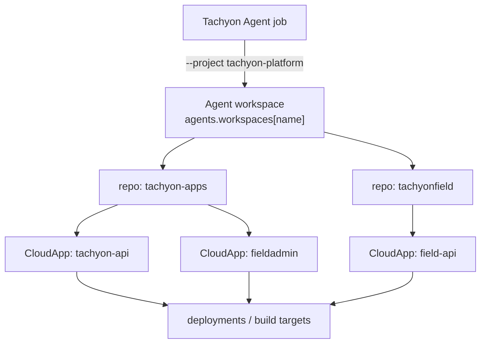

# PLT-1622 - Tachyon Agent workspaces

- Linear: PLT-1622 (High)
- GitHub: quantum-box/tachyon-apps#4633
- Branch: `feature/plt-1622`
- Status: Design

## Goal

Define Agent workspace as a first-class concept for Tachyon Agent jobs that need
to work across multiple repositories. This replaces the narrower idea of
treating `--project <name>` as a simple alias for a single `--cwd` value.

CloudApp remains the deployment unit: one repository produces one deployable
app target. Agent workspace is the task execution boundary: one named set of
repositories that an agent may inspect and edit during a single job.

Example task:

- modify `tachyon-api` in `tachyon-apps`
- modify `field-api` in `tachyonfield`
- deploy the resulting `fieldadmin` and `tachyon-api` CloudApps

That task cannot be represented by a single `metadata.cwd`. It needs a
workspace-level repository set and then one or more CloudApp deployment targets
inside that set.

## Proposed `tachyon.yaml` schema

Add an optional top-level `agents.workspaces` section. The section is valid in a
repository-local `tachyon.yml` or `tachyon.yaml` discovered by the CLI. Existing
CloudApp and CloudApps manifests remain valid when the section is absent.

```yaml
apiVersion: tachyon/v1
kind: CloudApps
metadata:
  name: tachyon-platform
  tenant_id: tn_example

agents:
  workspaces:
    - name: tachyon-platform
      description: Platform engineering workspace for agent tasks
      default_repo: tachyon-apps
      repos:
        - name: tachyon-apps
          path: /home/ubuntu/tachyon-apps
          role: primary
          cloud_apps:
            - tachyon-api
            - fieldadmin
        - name: tachyonfield
          path: /home/ubuntu/tachyonfield
          role: dependency
          cloud_apps:
            - field-api
      context:
        include:
          - tachyon-apps/docs
          - tachyonfield/README.md
        exclude:
          - "**/.env"
          - "**/.tachyon/secrets/**"

spec:
  apps:
    - name: tachyon-api
      framework: none
    - name: fieldadmin
      framework: vite
```

### Field meanings

| Field | Required | Description |
|-------|----------|-------------|
| `agents.workspaces[].name` | Yes | Stable workspace key used by `--project <name>`. |
| `description` | No | Human-readable purpose. |
| `default_repo` | No | Repo used as the primary `cwd` when a provider still requires one working directory. Must match one `repos[].name`. |
| `repos[].name` | Yes | Stable repo key. |
| `repos[].path` | Yes | Absolute path or config-relative path to the checked-out repository. |
| `repos[].role` | No | Advisory role such as `primary`, `dependency`, `docs`, or `deploy`. |
| `repos[].cloud_apps` | No | CloudApp names produced from this repo. This links workspaces to deployment targets without making CloudApp the workspace boundary. |
| `context.include` | No | Additional relative paths to send as explicit job context. |
| `context.exclude` | No | Glob patterns that must not be included in context packaging. |

The schema must not store expanded credentials, secrets, or environment values.
Any future secret or env integration should use existing reference-style config
such as `valueFrom` or provider-specific secret references.

### Naming

The CLI flag is `--project` for operator ergonomics, but the manifest concept is
`agents.workspaces`. In user-facing output, prefer "project/workspace" during the
transition and "workspace" in schema and API fields.

`tachyon.yaml` should be accepted as an alias for `tachyon.yml` when this schema
is implemented. The current CLI only documents `tachyon.yml`; implementation
should keep that file working and add `tachyon.yaml` discovery without changing
existing precedence.

## `tool-jobs create --project <name>` resolution

`tachyon ops tool-jobs create --project tachyon-platform --prompt "..."`
resolves a workspace, not a directory alias.

Proposed resolution order:

1. Load Tachyon config using the existing precedence:
   `TACHYON_CONFIG` > `--config` > cwd/parent discovery.
2. Read `agents.workspaces[]` and find exactly one workspace whose `name`
   matches `--project`.
3. Resolve each `repos[].path`.
   Relative paths are resolved against the directory containing the config file.
4. Validate every resolved repo path exists and is a directory.
5. Pick `default_repo` as the provider cwd when present. Otherwise use the first
   repo with `role: primary`, then the first repo in `repos[]`.
6. Build a tool job request that preserves both legacy and new metadata:
   - `metadata.cwd`: provider-compatible cwd from step 5
   - `metadata.project`: requested project/workspace name
   - `metadata.workspace.repos[]`: repo name, resolved path, role, and CloudApp links
   - `context_paths`: explicit paths from `--context-path` plus `context.include`
7. Reject ambiguous input:
   - `--project` name not found
   - duplicate workspace names
   - `default_repo` not listed in `repos`
   - both `--cwd` and `--project` set, unless a later implementation defines a
     strict override rule

Proposed request metadata shape:

```json
{
  "cwd": "/home/ubuntu/tachyon-apps",
  "project": "tachyon-platform",
  "workspace": {
    "name": "tachyon-platform",
    "default_repo": "tachyon-apps",
    "repos": [
      {
        "name": "tachyon-apps",
        "path": "/home/ubuntu/tachyon-apps",
        "role": "primary",
        "cloud_apps": ["tachyon-api", "fieldadmin"]
      },
      {
        "name": "tachyonfield",
        "path": "/home/ubuntu/tachyonfield",
        "role": "dependency",
        "cloud_apps": ["field-api"]
      }
    ]
  }
}
```

Providers that only understand a single cwd can continue using `metadata.cwd`.
Providers that understand workspaces can use `metadata.workspace.repos[]` to
open multiple roots, create worktrees per repo, and report per-repo changes.

## CloudApp relationship



CloudApp answers "what can be built and deployed?" Agent workspace answers
"what repositories are in scope for this agent task?" A workspace may reference
zero, one, or many CloudApps. A CloudApp may be referenced by more than one
workspace when different agent workflows share deployment targets.

## Implementation notes for a later PR

This design document intentionally does not implement the CLI change. A later
implementation should cover:

- config loader support for `agents.workspaces` and `tachyon.yaml`
- `tachyon ops tool-jobs create --project <name>`
- request metadata compatibility tests for legacy `--cwd`
- validation tests for duplicate names, missing repos, and invalid
  `default_repo`
- provider/runner behavior for multi-repo worktrees

## Open questions

- Should workspace definitions live only in repo-local config, or should users
  also be able to keep a global workspace registry under `~/.config/tachyon/`?
- Should `repos[].path` allow `~` expansion, or only absolute/config-relative
  paths?
- Should `cloud_apps` be advisory metadata only, or should it drive deploy
  authorization and follow-up deploy commands?
- Should `context.exclude` be enforced by the CLI before submission or by the
  worker when packaging repository context?
